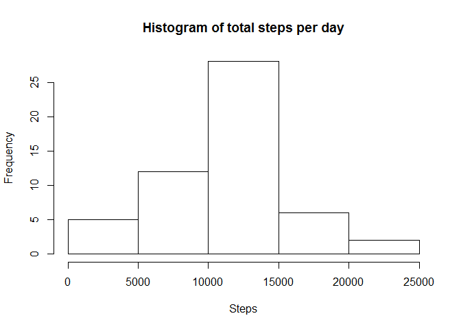
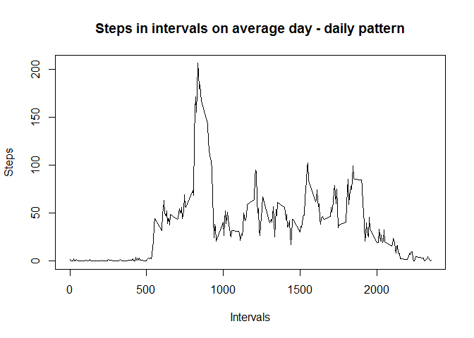
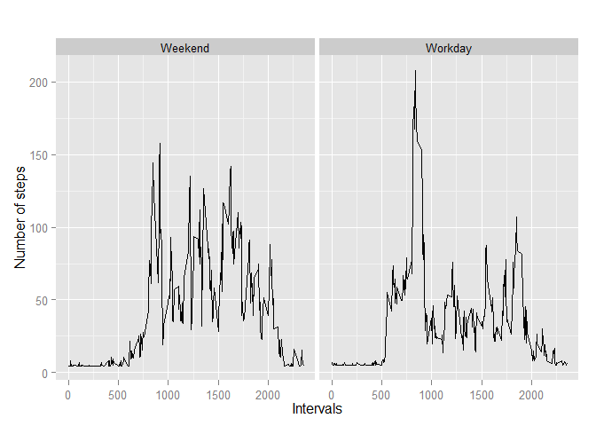

# Reproducible Research: Peer Assessment 1


## Loading and preprocessing the data
This codechunk sets workingdirectory, loads data and convert date column to date datatype.


```r
rm(list=ls(all=TRUE))

library(ggplot2)
```

```
## Warning: package 'ggplot2' was built under R version 3.1.2
```

```r
setwd("C:/Coursera/R/4_Rep_D_A/week_2")

dfbase<-read.csv("activity.csv")

dfbase$date <- as.Date(dfbase$date)

df<-dfbase
```


## What is mean total number of steps taken per day?
Here I ignore missing samples, calculate the total steps per day, change column names and plot the histogram.

```r
df <- na.omit(df)

stepsaggr<-aggregate(df$steps, by=list(df$date), FUN=sum, na.rm=TRUE)

names(stepsaggr)<-c("Date","Steps")

hist(stepsaggr$Steps, main = "Histogram of total steps per day", xlab="Steps" )
```

 

```r
stepsmean <- mean(stepsaggr$Steps)

stepsmedian <- median(stepsaggr$Steps)
```

```r
stepsmean #Mean of steps
```

```
## [1] 10766.19
```

```r
stepsmedian #Median of steps
```

```
## [1] 10765
```

## What is the average daily activity pattern?
Here I aggregate steps to intervals over the dataset. 

```r
avgday<-aggregate(df$steps, by=list(df$interval), FUN=mean)

names(avgday)<-c("interval","steps")

plot(avgday$interval, avgday$steps, type="l", main="Steps in intervals on average day - daily pattern", xlab="Intervals", ylab="Steps")
```

 
Interval of maximum number of step:

```r
avgday[which.max(avgday$steps),] 
```

```
##     interval    steps
## 104      835 206.1698
```


## Imputing missing values
Here I calculate the number of total samples (with no NA-s), create new dataset and fill NA-s with the mean of steps.

```r
nrow(dfbase[is.na(dfbase$steps),]) #Number of incomplete records
```

```
## [1] 2304
```

```r
df2<-dfbase

df2[is.na(df2$steps), 1]<-mean(df2$steps, na.rm=TRUE) #Eliminate NA-s with mean
```


## Are there differences in activity patterns between weekdays and weekends?
In this codechunk I aggregate number of steps using the new dataset, plot the histogram, and create time series of weekend and weekday.

```r
stepsaggr2<-aggregate(df2$steps, by=list(df2$date), FUN=sum, na.rm=TRUE)

names(stepsaggr2)<-c("Date","Steps")

hist(stepsaggr2$Steps, main = "Histogram of total steps per day, filled NA-s", xlab="Steps" )
```

 

```r
stepsmean2 <- mean(stepsaggr2$Steps)

stepsmedian2 <- median(stepsaggr2$Steps)
```

```r
stepsmean2 #Mean of steps
```

```
## [1] 10766.19
```

```r
stepsmedian2 #Median of steps
```

```
## [1] 10766.19
```
There is no huge impact of calculating with means instead of NA-s. It's worth to check the difference between the histograms.  


```r
df2$day <- weekdays(df2$date, abbreviate=T) #Calculate workday and weekend factors.

df2$workday <- c("Workday")

for (i in 1:nrow(df2)){
        if (df2$day[i] == "Szo" || df2$day[i] == "V"){
                df2$workday[i] <- "Weekend"
        }
} #I had some difficulty with the names of the days and character coding. SInce weekdays() use default language I've used also hungarian words. Sz = Saturday, V = Sunday.   

df2$workday <- as.factor(df2$workday)

nonasagg <- aggregate(steps ~ interval+workday, df2, mean)

qplot(interval, steps, data=nonasagg, geom=c("line"), xlab="Intervals", 
      ylab="Number of steps", main="") + facet_wrap(~ workday)
```

 
As we see pepole have different routine especially between interval 500 and 1000. 
